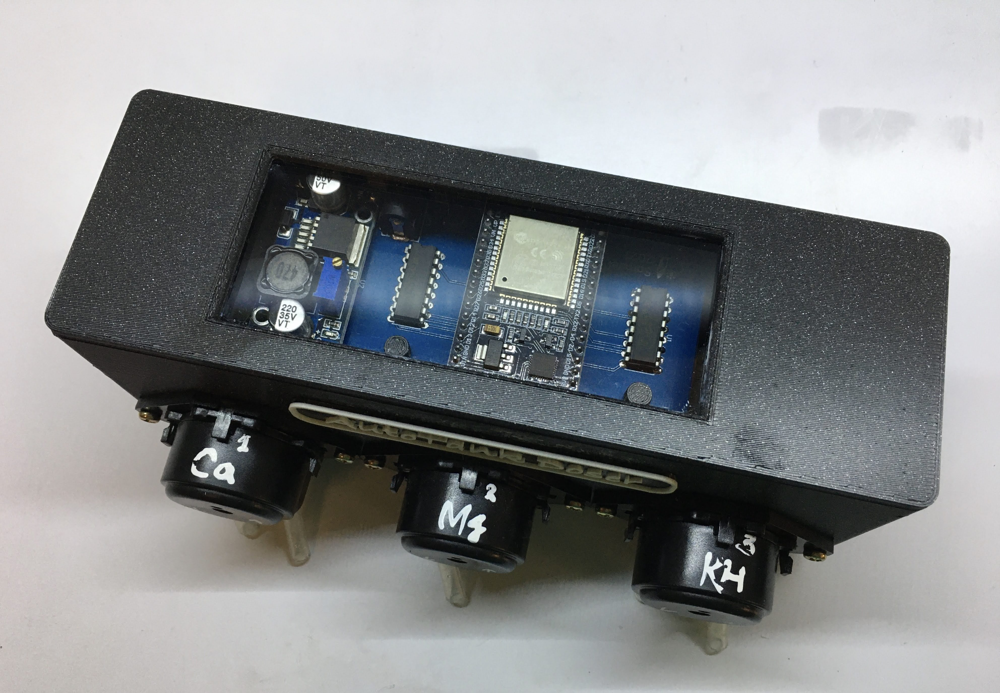
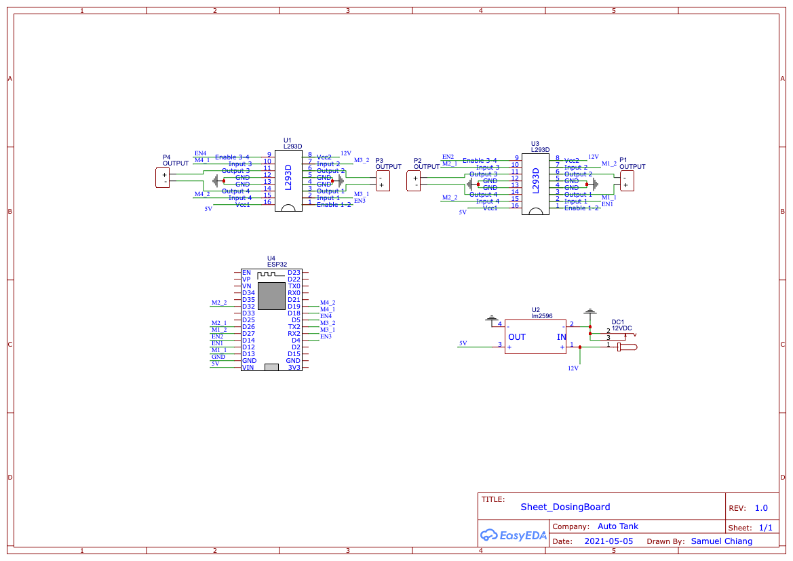
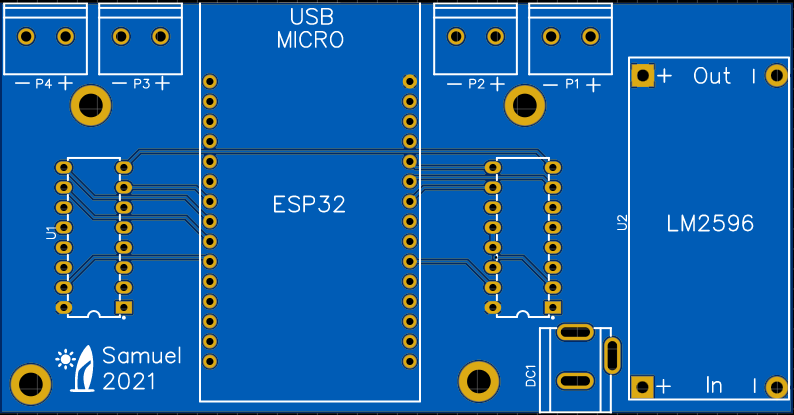

# ESP32_Doser
Use ESP32 to control DC Motor for dosing pump



## Features
- LM2596 input is DC3.2V~46V. The input voltage is depend on your DC motor. 12V or 24V DC motor should be OK.

- LM2596 output should adjust to 5V for ESP32 and L293D

- ESP32 can receive MQTT command to control DC motor

- ESP send PWM signal to L293D

## Schematic Diagram



## PCB Design
Please refer to
[https://oshwlab.com/sychiang0318/dosingbox](https://oshwlab.com/sychiang0318/dosingbox)


## Open software
[ESP32 Doser](src/DosingPumpPCB.ino)

## MQTT Data format
- Subscribe
  	- Topic
  		- `cmd/<DeviceId>/`
  	- Payload
		- Get command to run a pump
		
		```
		// Payload like
		    {
		       "command_id": int,
		       "command_type": int //1:move pump, 2:stop all pump
		       "pumpNumber": int , //0,1,2
		       "orientation": int, //0,1
		       "dutyCycle": int, //0~255
		       "duration": int  //in milliseconds
		     }
		```	
- Publish
	- Topic
		- `cmd_resp/<DeviceId>/`
	- Payload
		
		```
		// Payload like
		    {
		       "command_id": int,
		       "command_type": int //1:move pump, 2:stop all pump
		       "pumpNumber": int , //0,1,2
		       "orientation": int, //0,1
		       "dutyCycle": int, //0~255
		       "duration": int  //in milliseconds
		       "result": bool, //true/false
		       "error": string //error message
		     }
		```	
		
## 3D Printing Enclosure
[thingiverse](https://www.thingiverse.com/thing:5090305)

## More Information
[傻瓜滴定機 published on PH8.4 ](https://www.ph84.idv.tw/forum/threads/367581/)